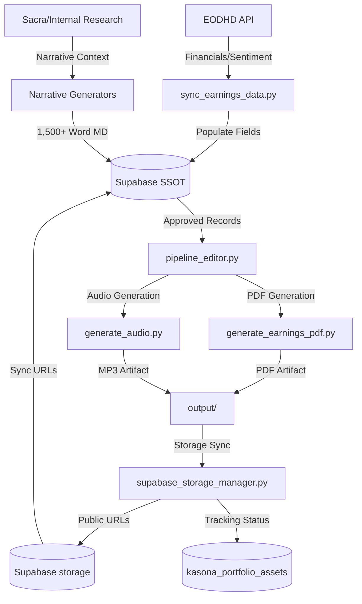

# Kasona Institutional: Project Handover (Kelvin)

This document provides a technical overview of the Kasona Institutional Earnings & Presentation pipeline, detailing tool interactions, database schemas, and synchronization flows.

## 1. System Architecture & Tool Interactions

 The pipeline follows a **Data → Narrative → Artifact → Sync** flow.

### Flow Diagram


### Key Tools
| Tool | Purpose | Primary Interaction |
| --- | --- | --- |
| `sync_earnings_data.py` | **Data Ingestion**. Fetches financial data from EODHD. | EODHD -> Supabase |
| `Giga_Expansion_1515.py` | **Narrative Generator**. Creates high-density institutional briefs. | Supabase -> LLM -> Supabase |
| `pipeline_editor.py` | **Atomic Orchestrator**. Generates and syncs branded artifacts. | Supabase -> Artifacts -> Storage |
| `generate_audio.py` | **Audio Engine**. Branded TTS with Intro/Outro formatting. | Markdown -> Neural Audio |
| `generate_earnings_pdf.py` | **PDF Engine**. Generates branded institutional reports. | Markdown -> PDF |
| `supabase_storage_manager.py` | **Sync Utility**. Handles storage uploads and URL updates. | Files -> Supabase Storage |

### Data Population Arsenal (Latest Versions)
- `populate_private_narratives_v3.py`: Latest for private equity/non-ticker entities.
- `populate_sa_de_narratives_v4.py`: Latest for German institutional (SA) narratives.
- `populate_sa_en_upgrades_v2.py`: Latest for English institutional (SA) narrative upgrades.

---

## 2. Core Synergy: SKILL.md vs. The Toolbox

The system operates as a "Governance & Execution" duality. **SKILL.md** provides the Standard Operating Procedure (SOP), while the **Tools** enforce those standards programmatically.

### 2.1 SKILL.md (The Executive Branch / SOP)
`SKILL.md` is the **source of truth for quality standards**. It defines:
- **Narrative Constraints**: 10-section structure, 1,515+ word count, zero "AI" or "EODHD" mentions.
- **Branding Standards**: Exact Intro/Outro scripts, mandatory last-page disclaimers, and logo fallback strategies.
- **Workflow Gates**: The `pending` -> `reviewed` -> `approved` cycle required for publication.

### 2.2 The Toolbox (The Legislative Branch / Execution)
The scripts act as the **enforcement layer** for the rules defined in `SKILL.md`:
- **Standardization**: `Giga_Expansion_1515.py` uses the `BERG-B.ST` baseline (defined in SKILL.md) to anchor all narrative generation.
- **Branding Injection**: `generate_audio.py` and `generate_earnings_pdf.py` hard-code the branding elements defined in the SOP to prevent "human error" during production.
- **Gatekeeping**: `pipeline_editor.py` strictly queries for `review_status = 'approved'`, ensuring no un-vetted content ever reaches Supabase Storage.
- **Compliance Auditing**: `final_portfolio_audit.py` cross-checks the production database against the **Required Column Matrix** (Section 6.1 of SKILL.md).

---

## 3. Supabase Infrastructure
All production data is centralized in the `nayggiozebvwqnpjzvvn` (Kasona CRM) project.

| Table | Purpose | Critical Columns |
| --- | --- | --- |
| `public.quarterly_earnings` | Main storage for quarterly artifacts and narratives. | `markdown_content`, `pdf_report_url`, `audio_report_url`, `review_status`, `uploaded`, `impact_score` |
| `public.company_presentation` | Structural company analysis (Invest-Thesis). | `markdown_content`, `pdf_report_url`, `investment_thesis` |
| `public.kasona_portfolio_assets` | Portfolio-wide production tracking. | `earnings_produced`, `last_earnings_period`, `presentation_produced`, `production_updated_at` |

### 2.2 Storage Buckets
Artifacts are synchronized to specific buckets with public access.

| Bucket | Content | Naming Convention |
| --- | --- | --- |
| `earnings-reports-pdf` | Institutional PDF Reports | `[PROFILE]/[TICKER]_earnings.pdf` |
| `earnings-reports-audio` | Branded Audio Briefings | `[PROFILE]/[TICKER]_audio.mp3` |
| `company-presentation-pdf` | Landscape Presentation Reports | `[TICKER]_presentation.pdf` |

---

## 3. Operations & Population Flow

### Level 1: Data Sync
Run ingestion for a specific ticker to populate financial metadata.
```bash
python tools/sync_earnings_data.py --ticker AAPL.US --period Q4 --year 2025
```

### Level 2: Narrative Generation
Use one of the expansion tools to generate the 10-section institutional narrative.
```bash
python tools/Giga_Expansion_1515.py --ticker AAPL.US
```

### Level 3: Manual Approval
1. Review the generated `markdown_content` in the Supabase Dashboard.
2. Set `review_status = 'approved'`.

### Level 4: Atomic Publication
Run the batch orchestrator to generate PDF/Audio and sync to storage.
```bash
python tools/pipeline_editor.py --batch-approved --type earnings
```
This tool automatically:
1. Generates the PDF (branded cover + last page).
2. Generates Audio (Kasona Intro/Outro + Neural voices).
3. Uploads both to Supabase Storage.
4. Updates `pdf_report_url` and `audio_report_url` in the database.
5. Updates the delivery status in `kasona_portfolio_assets`.

---

## 4. Maintenance & Auditing
- `final_portfolio_audit.py`: Checks for missing scores or broken URLs across the portfolio.
- `purge_and_sync_institutional.py`: Recovery tool to wipe and re-sync a clean storage environment.
